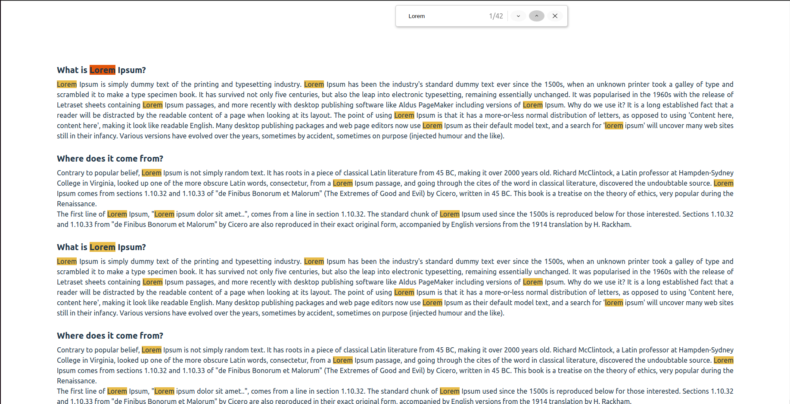

# KeyWord Finder

This is a Keyword Finder project build using React. With this app you will be able to search keyword

## Demo

[Demo](https://text-highlighter.vercel.app/)

## Screenshots

## Features

- Users can search for the keyword in the pop-up search box appeared when clicking `Ctrl+f`.
- Searched keywords are highlighted.
- Users can scroll smoothly through the keywords using the next `v` and previous `^` buttons.
- `X` button can be used to close the pop-up window.

## Usage

- Clone the project
- Install dependencies
- Press `Ctrl+F` to open pop-up window
- Search for keywords
- All instances of keywords will be highlighted in dark yellow
- Navigate through highlighted text using next `v` and previous `^` buttons
- Currently highlighted text is in red color
